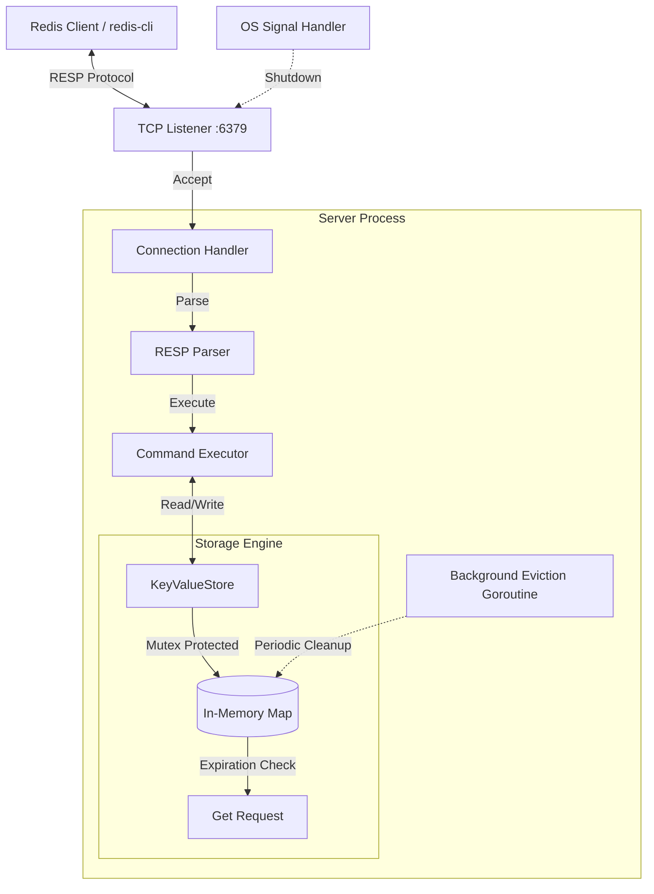

# Redis Personal Project (Personal-Redis)

A high-performance, concurrent, Redis-compatible in-memory key-value store built with Go.


## 🚀 Overview

Personal-Redis is a lightweight implementation of the Redis Serialization Protocol (RESP) and a thread-safe in-memory storage engine. It features active background eviction for expired keys, graceful shutdown support, and a growing list of supported Redis commands.

### Key Features

- **Concurrent Access**: Thread-safe storage engine using `sync.RWMutex`.
- **Automatic Eviction**: Background goroutine actively removes expired keys.
- **RESP Compliant**: Supports standard Redis clients like `redis-cli`.
- **Graceful Shutdown**: Handles OS signals (SIGINT, SIGTERM) to shut down cleanly.
- **Production Ready**: Includes unit tests, structured logging, and robust error handling.

## 🏗️ Architecture

The following diagram illustrates the internal working of the application:



## 🛠️ Commands Supported

| Category | Commands |
| --- | --- |
| **Connection** | `PING`, `ECHO`, `QUIT` |
| **Generic** | `GET`, `SET`, `DEL`, `EXISTS`, `EXPIRE`, `DBSIZE`, `INFO` |
| **Strings** | `INCR`, `MGET`, `MSET` |
| **System** | `COMMAND` (minimal) |

## 📦 Getting Started

### Prerequisites

- [Go](https://golang.org/doc/install) 1.22 or higher.

### Installation

```bash
git clone https://github.com/kunal-1207/redis-personal-project.git
cd redis-personal-project
```

### Running the Server

```bash
go run cmd/main.go
```

### Running Tests

```bash
go test -v ./cmd/...
```

## 🖥️ Usage

Connect to the server using `redis-cli`:

```bash
# Basic operations
redis-cli PING
redis-cli SET user:1 "Kunal"
redis-cli GET user:1

# Operations with expiration
redis-cli SET temporary "value" EX 10
redis-cli EXPIRE user:1 60

# Atomic increment
redis-cli SET counter 10
redis-cli INCR counter

# Multi-key operations
redis-cli MSET a 1 b 2 c 3
redis-cli MGET a b c
```

## 🛡️ License

This project is licensed under the MIT License - see the [LICENSE](LICENSE) file for details.
