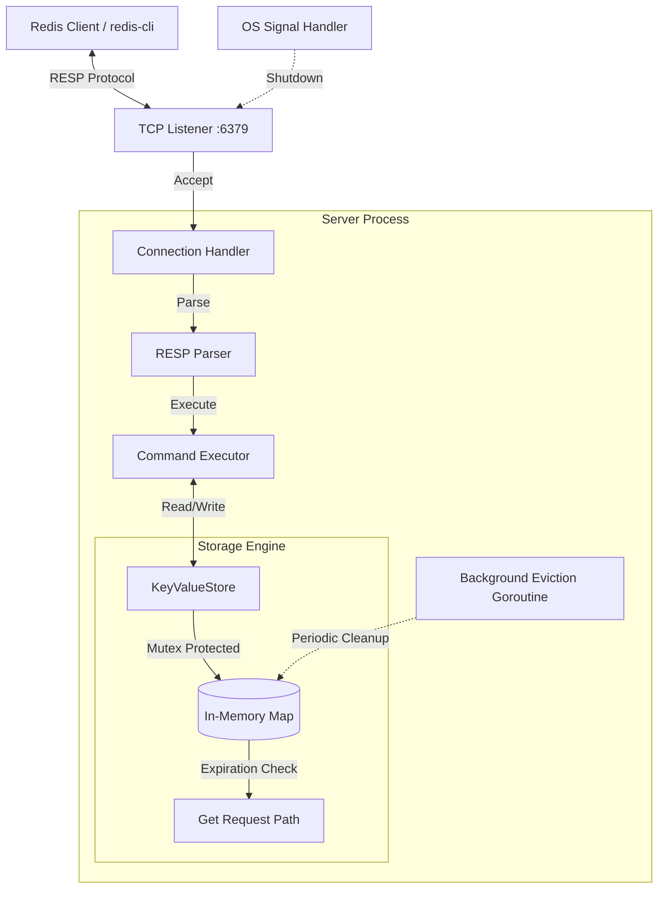

# Redis Personal Project (Personal-Redis)

A high-performance, concurrent, Redis-compatible in-memory key-value store built with Go.


---

## 🚀 Overview

**Personal-Redis** is a lightweight yet robust implementation of the Redis Serialization Protocol (RESP), designed to emulate core Redis behavior with a focus on concurrency, correctness, and system-level reliability.

This project demonstrates backend systems design principles such as:

* Concurrent request handling
* Memory-efficient data structures
* Background task orchestration
* Graceful process lifecycle management

It is fully compatible with standard Redis clients like `redis-cli`.

---

## ✨ Key Features

* **Concurrent Access**

  * Thread-safe in-memory store using `sync.RWMutex`
  * Optimized for high read/write throughput

* **Active Key Expiration**

  * Background eviction worker removes expired keys proactively
  * Prevents memory bloat and stale data accumulation

* **RESP Protocol Support**

  * Fully compatible with Redis clients (`redis-cli`)
  * Custom RESP parser and command dispatcher

* **Graceful Shutdown**

  * Handles `SIGINT` and `SIGTERM`
  * Ensures clean resource deallocation and connection closure

* **Production-Oriented Design**

  * Structured logging
  * Unit testing coverage
  * Defensive error handling

---

## 🏗️ Architecture

The following diagram illustrates the internal architecture and request lifecycle:



### 🔍 Flow Explanation

1. Client sends a request using RESP
2. TCP Listener accepts incoming connections
3. Each connection is handled concurrently
4. RESP Parser decodes the request
5. Command Executor processes logic
6. Data is read/written from the thread-safe store
7. Background goroutine continuously cleans expired keys

---

## 🛠️ Supported Commands

| Category       | Commands                                                  |
| -------------- | --------------------------------------------------------- |
| **Connection** | `PING`, `ECHO`, `QUIT`                                    |
| **Generic**    | `GET`, `SET`, `DEL`, `EXISTS`, `EXPIRE`, `DBSIZE`, `INFO` |
| **Strings**    | `INCR`, `MGET`, `MSET`                                    |
| **System**     | `COMMAND` (minimal implementation)                        |

---

## 📦 Getting Started

### Prerequisites

* Go **1.22+**

---

### Installation

```bash
git clone https://github.com/kunal-1207/redis-personal-project.git
cd redis-personal-project
```

---

### Running the Server

```bash
go run cmd/main.go
```

The server starts on:

```
localhost:6379
```

---

### Running Tests

```bash
go test -v ./cmd/...
```

---

## 🖥️ Usage

Connect using `redis-cli`:

```bash
# Health check
redis-cli PING

# Basic key-value operations
redis-cli SET user:1 "Kunal"
redis-cli GET user:1

# Expiration
redis-cli SET temp "value" EX 10
redis-cli EXPIRE user:1 60

# Atomic operations
redis-cli SET counter 10
redis-cli INCR counter

# Multi-key operations
redis-cli MSET a 1 b 2 c 3
redis-cli MGET a b c
```

---

## 📈 Future Improvements (Optional but strong for SRE angle)

If you want this to stand out for SRE/DevOps roles, add:

* Persistence (AOF / RDB-like snapshots)
* LRU/LFU eviction policies
* Metrics endpoint (Prometheus)
* Benchmarking suite
* Connection pooling
* Docker + Kubernetes deployment
* Load testing with tools like `k6`

---

## 🛡️ License

This project is licensed under the MIT License. See the [LICENSE](LICENSE) file for details.

---


